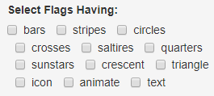
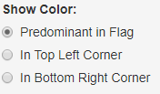

<style>
.small-code pre code {
  font-size: 1em;
}
p {
  font-size: 1em;
}
</style>

Country Flags Explorer
========================================================
date: Thursday, March 21, 2019
autosize: true


You can use and copy this application freely. Just don't forget to recognize the involved sources and authors, like me. 

Have fun as much as I did!

*[Nicolas E. Kuzminski](http://www.linkedin.com/in/nekuz/)*

About
========================================================
autosize: true
left: 40%
class: small-code


```
   color countries area pop
1    red       37%  48% 48%
2   blue       21%  12%  5%
3  green       16%  18% 13%
4  white       11%  11% 13%
5   gold       10%   5%  3%
6  black        3%   1%  3%
7 orange        2%   4% 16%
8  brown        1%   0%  0%
```

***
<small>This application shows a [choropleth map](http://en.wikipedia.org/wiki/Choropleth_map) of the world countries coloured according to the colors of their flags. It was made as an [R Language](http://www.r-project.org/about.html) little project for the ["Developing Data Products Course by Johns Hopkins" on Coursera](http://www.coursera.org/learn/data-products), using [Shiny](http://shiny.rstudio.com/) web framework and [Leaflet](http://leafletjs.com/) map visualization. The base world map is provided online by [OpenStreetMap](http://openstreetmap.org/), the political land borders (polygons) are from [Geo-Maps](http://github.com/simonepri/geo-maps).  I've published this project's [source code on Github](http://github.com/nicokuz/Country-Flags-Explorer), which I've made freely available for anyone to use and modify for their own project.</small>

Map
========================================================
autosize: true
left: 40%

<small>

```
[1] "Current map has 220 countries. 135 (61%) flags matched. Other 58 flags are old or couldn't be matched."
```
</small>

***
<small>The map shows the world countries political land territories coloured by their national flags. It can be navigated  the usual way, with the mouse cursor or the arrow keys. When hovering with the mouse cursor over the colored countries, a popup will be shown with the country name, an image of its flag, the numeric value of its population in millions, and its area in thousands square kilometers. Bear in mind that the [Flags source dataset](http://archive.ics.uci.edu/ml/datasets/Flags) dates from 1986, so the data my differ with images, even some countries doesn't match with the current political map (ie, the Soviet Union) so they aren't shown at all.</small>

Controls
========================================================
left: 40%
### Flag Features Filter


<small>Check the boxes to display flag color and data only for the countries having the corresponding shape feature on its flag:</small>
- <small>Vertical **bars**</small>   
- <small>Horizontal **stripes**</small> 

***
- <small>**Circles**</small> 
- <small>Upright **crosses**</small> 
- <small>**Saltires** (Diagonal crosses)</small>
- <small>**Quarters** (Quartered Sections)</small>
- <small>**Sunstars** (Sun or star symbols)</small>
- <small>**Crescent** moon symbol</small>
- <small>**Triangle**s</small> 
- <small>**Icon** (Inanimate image)</small>
- <small>**Animate** icon (e.g., an eagle, a tree, a human hand)</small>
- <small>**Text** (e.g., a motto or slogan)</small>

Controls
========================================================
### Country Statistics Filter


<small>Use the sliders to display flag color and data only for the countries being in the selected ranges, selecting the minimum and maximum values to filter:</small>

- <small>**By Area** territory in thousand square kilometers</small>   
- <small>**By Population** inhabitants in millions</small>

***
### Flag Color Shown 


<small>Use these radio buttons to select that the flag colors shown on the map corresponds to the color:</small>

- <small>**Predominant in Flag** (Tie-breaks decided by taking the topmost hue, if that fails then the most central hue, and if that fails the leftmost hue)</small> 
- <small>**In Top Left Corner** (moving right to decide tie-breaks)</small>
- <small>**In Bottom Right Corner** (moving left to decide tie-breaks)</small>
